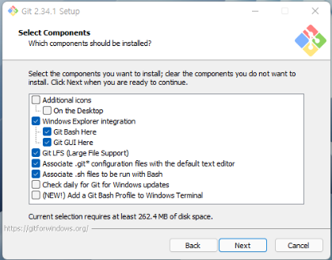

# Why Git?
1. Git은 프로젝트의 "시간"과 "차원"을 자유롭게 넘나들 수 있도록 해줍니다. 
- 시간: 프로젝트의 버전을 과거로 되돌리거나 특정 내역을 취소할 수 있습니다.
- 차원: 프로젝트의 여러 모드를 쉽게 전환한고 관리할 수 있습니다.

2. Git은 여러 사람들이 프로젝트에서 협업할 수 있도록 도와줍니다.  
<br>


# Git 설치
- https://git-scm.com/ 로 이동해서 Git을 다운로드합니다.

- ⭐️ 설치과정에서 Git Bash를 반드시 포함시켜주세요!
    - Git 사용에 적합한 터미널
    - 리눅스/맥(유닉스)에서 사용되는 CLI 명령어들을 윈도우에서 사용가능 - 타 프로그래밍에도 유용
    - 기본 설정된 그대로 설치를 진행하시면 됩니다.
    - CLI : 명령줄 인터페이스(Command-Line Interface)의 줄임말로 글자를 입력하여 컴퓨터에 명령을 내리는 방식이다.

    - 

- 설치 후 Git Bash에서 아래 명령어로 테스트해보세요

```bash
git --version
```

- [추가사항] 아래 명령어를 한 번 입력해주세요!
```bash
git config --global core.autocrlf true
```

-> 협업시 윈도와 맥에서 엔터 방식 차이로 인한 오류를 방지합니다.  
<br>


# SourceTree 설치
- https://www.sourcetreeapp.com/ - Git을 GUI로 다룰 수 있도록 해주는 툴입니다.

    - 기타: GitHub Desktop, GitKraken 등 (https://git-scm.com/downloads/guis 참조)

- 설치시 BitBucket 계정 관련은 건너뛰기하셔도 좋습니다.
<br>
<br>


# VS Code 설치는 SKIP  
<br>


# VS Code의 기본 터미널을 Git Bash로 설정
Git 뿐 아니라 다른 프로그래밍 작업에 있어서도 유용
- VS Code에서 ```Ctrl``` + ```Shift``` + ```P```
- Select Default Profile 검색하여 선택
- 터미널에서 +로 새 창을 열어서 기본으로 Git Bash가 설정된 것 확인
- [추가사항] Git Bash를 "C 드라이브"에 설치해야 이 설정이 가능합니다.
<br>
<br>


# [추가사항] 머터리얼 테마
- 머터리얼 테마 에디터 추가